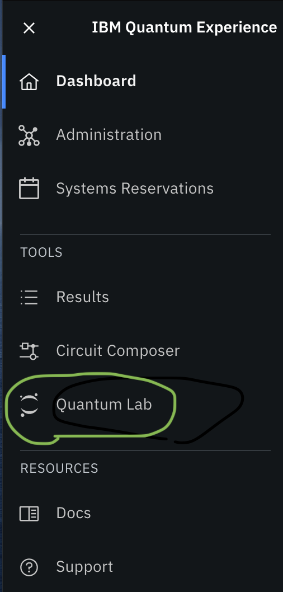
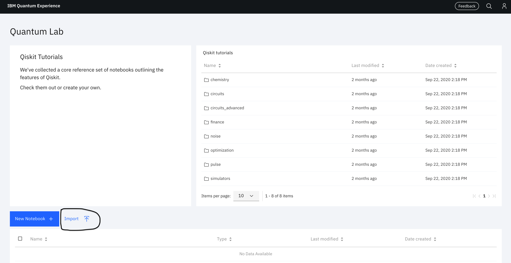
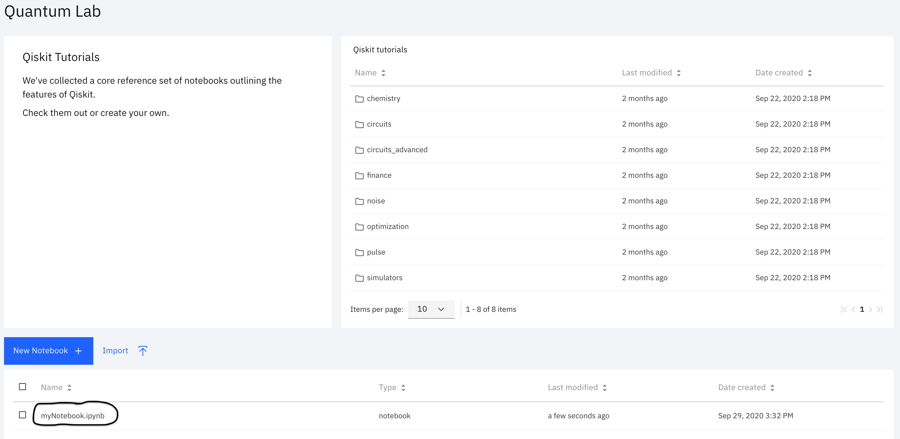
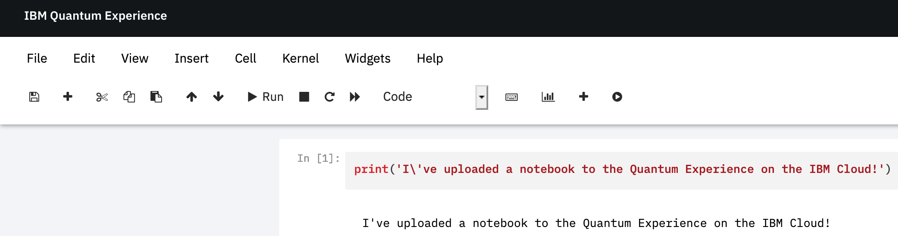

# Uploading notebooks to the Quantum Lab

The purpose of this document is to help you upload notebooks for the tutorial(s) you are participating in. It assumes you already have an account with our Quantum Experience on the IBM Cloud. If you do not, sign up here. (TODO: include social link).

If you are participating in a tutorial, you should first download the relevant file(s) from the directory in this repository.

## Uploading files

First, you need to navigate to the Quantum Lab via the sidebar on the Quantum Experience:

  
This takes you to the Quantum Lab page. Besides including a list of handy tutorials on the right, and the ability to create your own Jupyter notebooks hosted on the IBM Cloud, you can also upload notebooks using the Import button:

  
Then, you use your browser's file browser to navigate to the notebook you'd like to upload. Here, I've uploaded the notebook `myNotebook`

  
Then, I can click on the notebook and it launches in the Quantum Lab:

  
Now you are ready to upload notebooks for the tutorials to the Quantum Lab!
